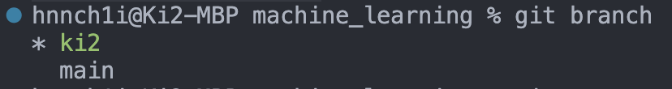
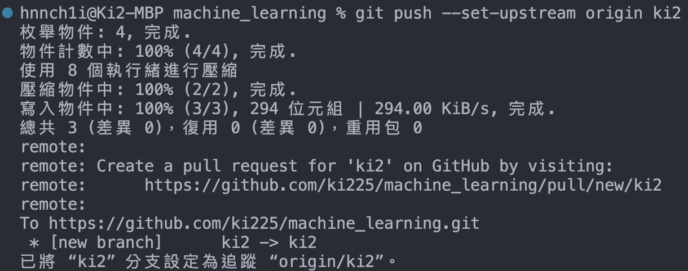
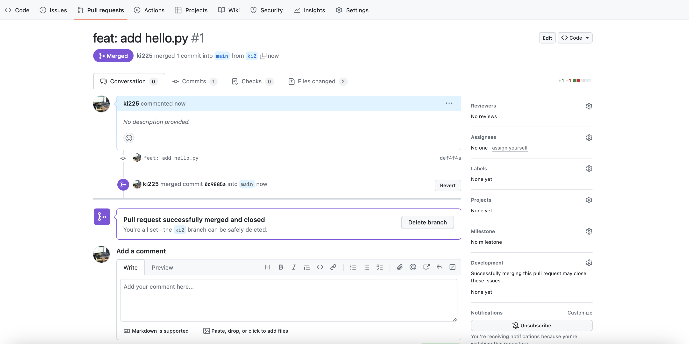
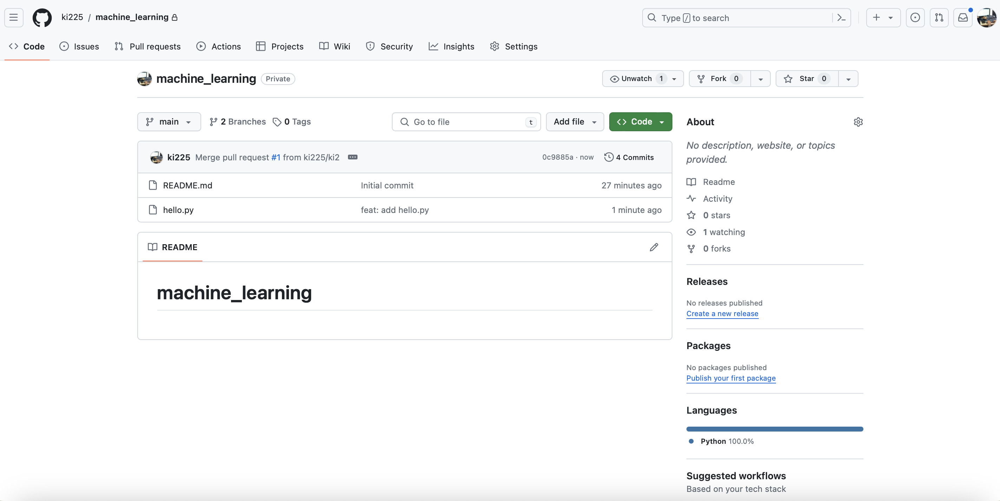
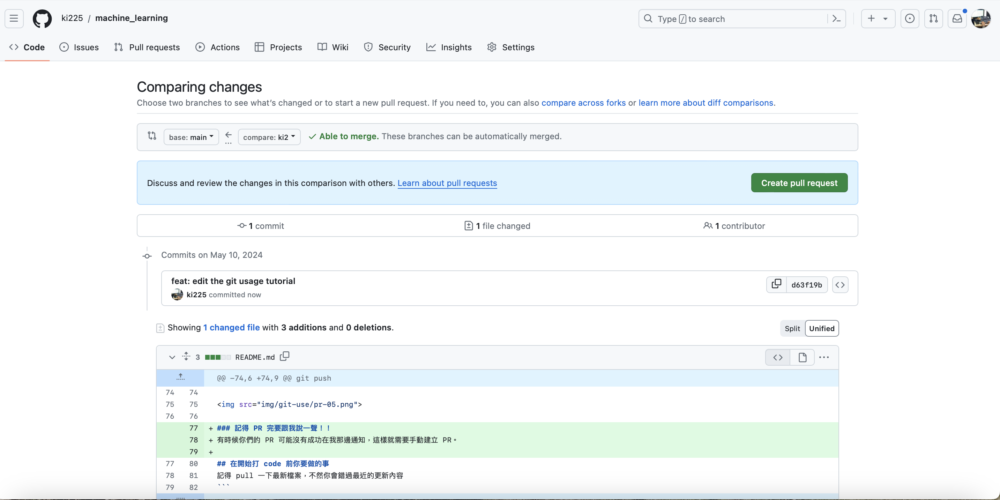

# machine_learning
想說之後大家都會用到，而且 git 真的蠻重要的，所以就一起來學看看吧，try try ！
## 在本地連接遠端 repo
### step1. clone repo
進入你要放這個資料夾的上一層目錄，比方說我想把這個期末專案放在"機器學習概論"底下，我就進入機器學習概論的目錄，執行下列指令把遠端 repo clone 下來
```
git clone https://github.com/ki225/machine_learning.git
```


### step2. 進入你 clone 的目錄
針對該 repo 的 git 環境會在那個資料夾裡面，沒進去的話可能會爬到其他的 git 設定ㄛ～
```
cd machine_learning
```

### step3. 建立你的分支
每個人都動到 main 的話會很難管理，所以我們就一人建立一個自己的分支。下面的指令是用在第一次建立分支：
```
git checkout -b <你的 branch 名字>
```
例如：
```
git checkout -b ki2
```
成功的話就會顯示「已切換至新分支 “ki2”」，你們應該是顯示英文版的。這時候你也可以看有哪些 branch，用下面的指令：
```
git branch
```


## 上傳資料的方法
先說！！一定要先儲存檔案才能傳上去喔
### step1. 設定上游
如果你的分支沒有設定上游的話，他之後會不知道要 push 去哪。


```
git push --set-upstream origin <你 branch 名稱>
```


### step2. 決定你要上傳的檔案
```
git add <你要上傳的檔案名稱>
```
通常我們都把整包資料夾扔上去(如果確定整包的內容都是有意義的)，指令如下
```
git add .
```
### step3. 說明你要 commit 的內容
```
git commit -m "敘述"
```
敘述內容通常有一套格式，但我覺得我們初學可以不用太介意這個，詳細說明你修改/增加的功能就好了

### step4. 推推
```
git push
```
以下是我推推檔案的示範：


### 推上去之後呢～？
我這邊會看到你們的 PR(pull request)，審完 code 後會確認 PR，讓你們的更改合進 main 裡面。





若沒有顯示 PR，我就會手動建立 PR。


成功的時候你們就會拿到 PR 鯊鯊啦～


### 記得 PR 完要跟我說一聲！！
PR 成功推上去後我不會收到通知，所以大家要跟我說一聲～

## 在開始打 code 前你要做的事
記得 pull 一下最新檔案，不然你會錯過最近的更新內容
```
git pull origin main
```


## 好用套件
看你們要哪個，我都有啦
### git graph
可以看到所有人的分支搞在一起的畫面，很刺激


### gitlens
- 通常就在底下的工具欄
- 可以切換要看哪個分支和資料夾
- (我不知道能不能看到所有人的 branch，沒試過)


## 其他指令分享
### 有事沒事 status 一下
可以看一下自己的分支、有沒有檔案忘記 git add 上去
```
git status
```
### 這個版本出 trouble ㄌ我想回到上一步 TAT
可以查看過去的紀錄
```
git log
```


切過去，這個方法適用於切換過去紀錄/branch
```
git checkout <commit編號 / branch名字>
```
如果你們 pull 完發現原本檔案被蓋掉之類的，可以用這找回到之前的紀錄。