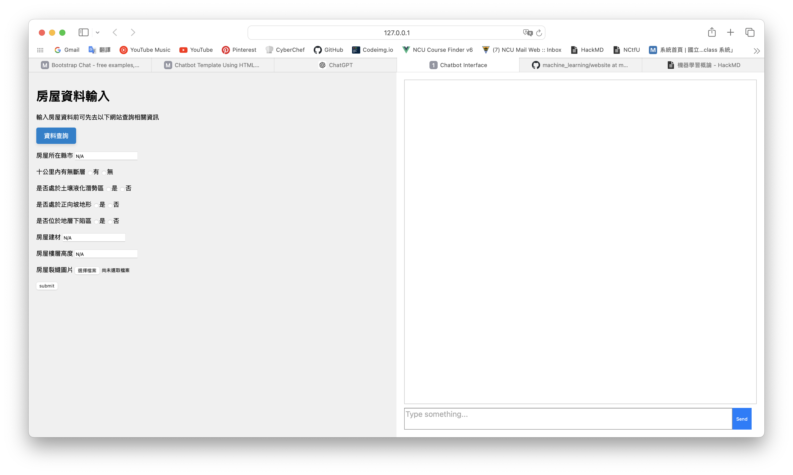

model檔案太大，放在這:https://drive.google.com/drive/folders/1OW-yswnYkXlB_AiaFjveYM4el4-kh23p?usp=drive_link

網頁左半邊是表單輸入，輸入的內容是使用者的房屋資訊，用來給大型語言模型以及圖像辨識模型；右半邊是機器人的對話框，我們會將與機器人的對話、模型預測結果都輸出在右邊聊天區域。目前有做初步的前後端整合，你們可以把後端我註解說明的那邊改成大型語言模型的輸入。

model 資料夾底下是 y-shape 裂縫的模型，再麻煩把巧柔的裂縫辨識跟宜縈的 x-shape 裂縫模型結合！

